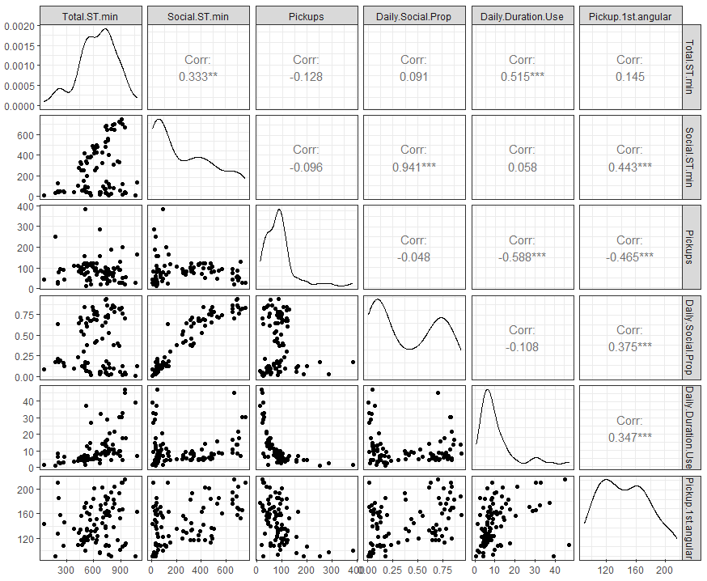
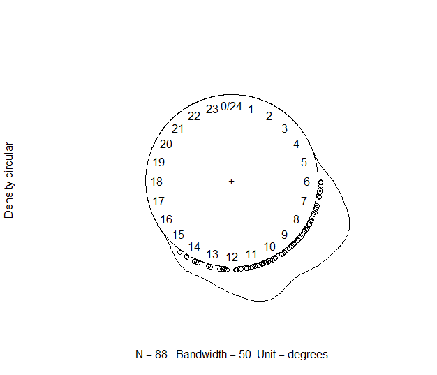
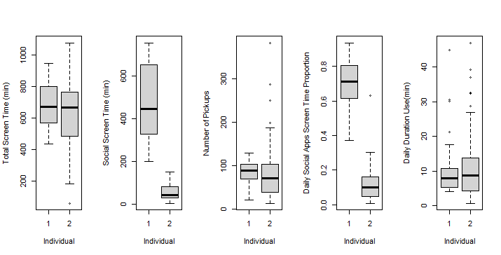
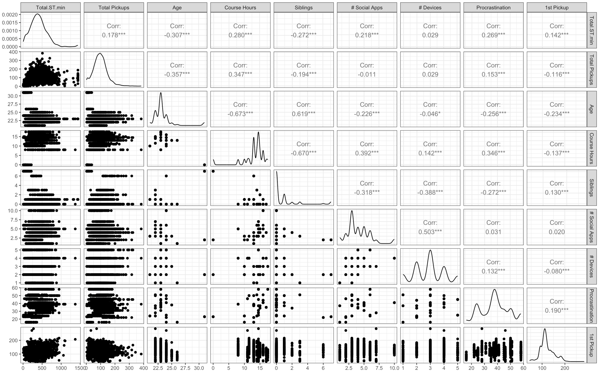
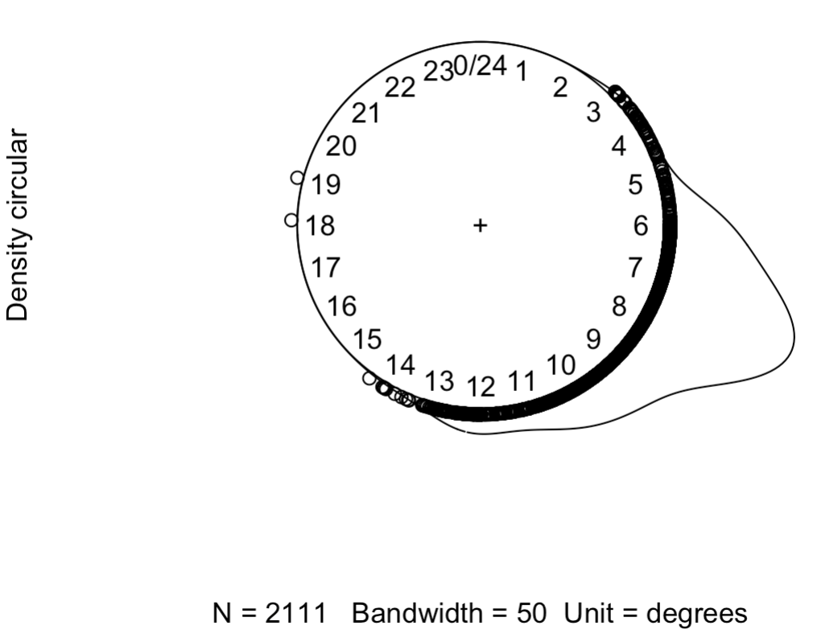
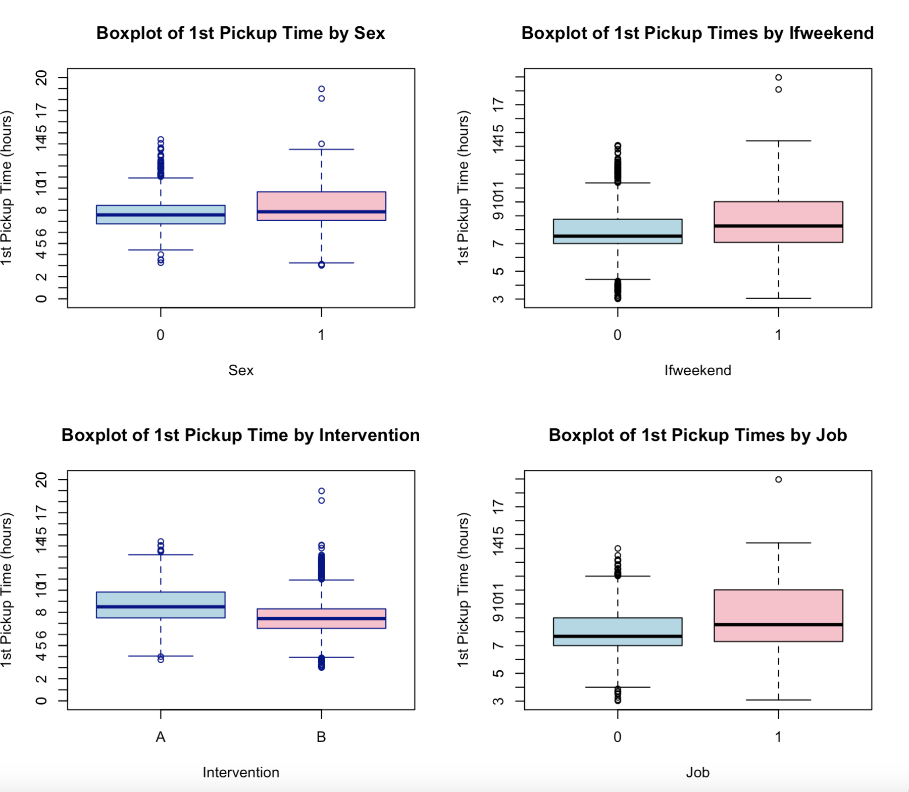
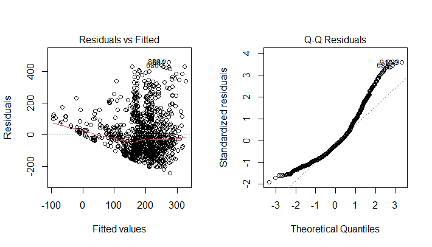
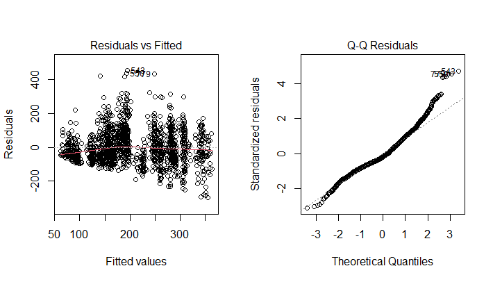

# Project 1: How Social Apps Relate to Wake-Up Times in College Life, A Federated Learning Study

## Authors
- [Lufeiya Liu](https://github.com/feiyaLL)
- [Anran Yao](https://github.com/anranyao)

## Description
Smartphones are an essential aspect of college students' daily lives, sparking concerns about their effects on mental and physical health. This study examines the impact of social application screen time on college students' sleep patterns, specifically focusing on wake-up times. Utilizing federated learning and linear regression methods to analyze phone usage data while maintaining data privacy, we investigated the relationship between social application usage and wake-up times. The data, collected from two University of Michigan students, indicated a significant positive correlation between the amount of time spent on social apps and later wake-up times. This was after considering variables like daily phone pickups and whether it was a weekday or weekend. Our findings demonstrate the effectiveness of federated learning in achieving results that align with those from traditional linear regression.

## Files
[R code](codes_v1.R)

[Result outputs](codes_v1.pdf)

## Data collection and Description Plots
Data were collected from two students at the University of Michigan who were taking the Biostatistics 620 course during the Winter 2024 semester. Each student recorded data every day from January 1, 2024, to February 13, 2024. The data from each student (n1=44, n2=44) were combined into one dataset (n=88) for further analysis (confirmation analysis). Since there was no missing data in this dataset, no records were removed from the analysis.

# Project 2: Assessing the Impact of Screen Time and Device Access Interventions on Mobile Addiction Among College Students

## Authors
- [Lufeiya Liu](https://github.com/feiyaLL)
- [Anran Yao](https://github.com/anranyao)

## Description
This study evaluates the efficacy of two distinct interventions aimed at reducing mobile phone addiction among 34 college students enrolled in a Biostatistics course at the University of Michigan during the Winter 2024 semester. The interventions, categorized into limiting total daily screen time to 200 minutes (Intervention A) and reducing the number of daily device pickups to 50 (Intervention B), were implemented over a one-week period from March 27, 2024, to April 2, 2024. Data analysis involved multiple regression models to explore the impact of these interventions on daily social app screen time and compliance rates. The findings indicate that Intervention A significantly reduced mobile usage, whereas Intervention B showed no notable effect on screen time but influenced compliance behaviors. The study highlights the importance of tailored intervention strategies to mitigate excessive mobile usage among college students, suggesting that limiting screen time is more effective than restricting pickups. These insights are crucial for developing targeted approaches to address mobile addiction in academic settings.

## Files
[R code](project_2/project2.R)

## Data collection and Description Plots

## Model Diagnosis

## Acknowledgment
In this project, Lufeiya Liu and Anran Yao contributed equally. Both were responsible for data cleaning, data analysis, model diagnosis, and drafting the report. We thank Dr. Peter Xuekun Song (University of Michigan) for assigning and guiding the project.
